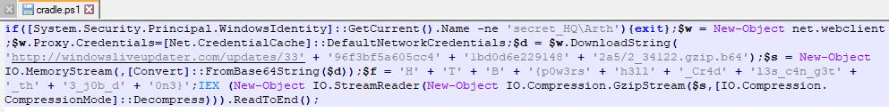
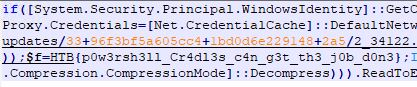

# Alien Cradle

*In an attempt for the aliens to find more information about the relic, they launched an attack targeting Pandora's close friends and partners that may know any secret information about it. During a recent incident believed to be operated by them, Pandora located a weird PowerShell script from the event logs, otherwise called PowerShell cradle. These scripts are usually used to download and execute the next stage of the attack. However, it seems obfuscated, and Pandora cannot understand it. Can you help her deobfuscate it?*

We are given a PowerShell script.

## Technical Analysis
After opening the script with a text editor, we see that the contents are obfuscated. Fortunately, it is still readable.

Taking a closer look at the script we see pieces of the code, but it is obviously not formatted properly. We can search and replace spaces, +, ' as needed.
