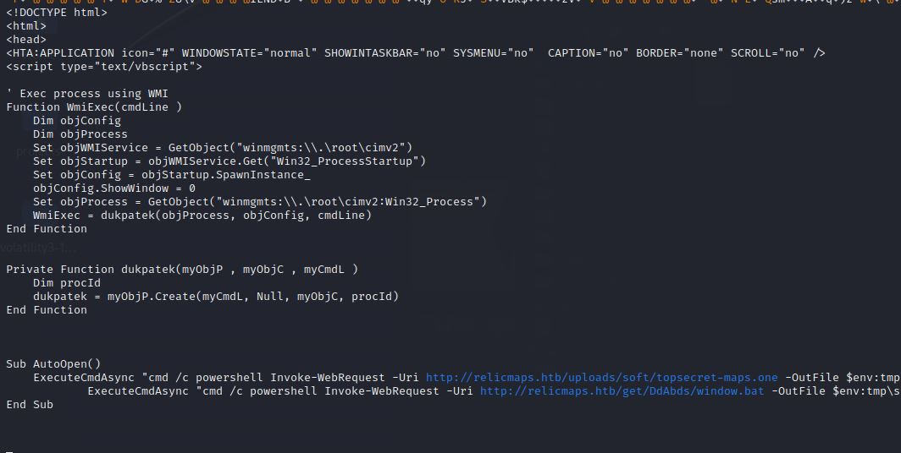
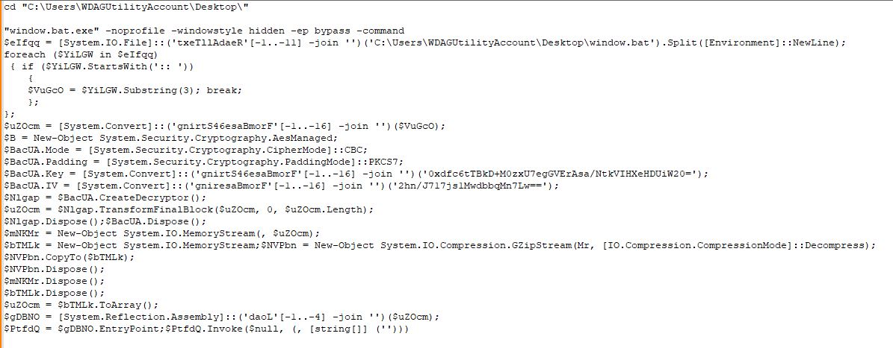

# Excerpt

*Pandora received an email with a link claiming to have information about the location of the relic and attached ancient city maps, but something seems off about it. Could it be rivals trying to send her off on a distraction? Or worse, could they be trying to hack her systems to get what she knows? Investigate the given attachment and figure out what's going on and get the flag. The link is to http://relicmaps.htb:/relicmaps.one. The document is still live (relicmaps.htb should resolve to your docker instance).*

# Technical Analysis
I was not able to resolve the host name despite configuring the /etc/hosts file, not too sure why. But using the given IP address and port to download the original attachment works anyways.


The attachment has a lot of unreadable code. But if we scroll a bit down, we see a PowerShell script.


We can see that there are two Invoke-WebRequests for two files: `topsecret-maps.one` and `window.bat`. It also tells us where we can download it from.


Similar to the original attachment, `topscret-maps.one` had a lot of junk. The only notable clue would be a function called dukpatek() and two Invoke-WebRequests indicating the hacker used OneNote as an attack vector.


The `window.bat` is obfuscated to the teeth. One thing that stands out is the blocks of text that isn't like the rest:


I switched over to my Windows Sandbox and downloaded the window.bat file.

First, at the top of the batch file, I turned @echo to on. And at the end of the file, I put echo statements at the beginning of each line to see what the outputs would be. And to make sure it doesn't close after running, I used `pause` instead of `break`.


Running it, we get something like this:


Not the prettiest, so I put it into a text editor and broke it down.


The most noteable lines would be 
`$BacUA.Key = [System.Convert]::('gnirtS46esaBmorF'[-1..-16] -join '')('0xdfc6tTBkD+M0zxU7egGVErAsa/NtkVIHXeHDUiW20=');`
and
`$BacUA.IV = [System.Convert]::('gniresaBmorF'[-1..-16] -join '')('2hn/J717js1MwdbbqMn7Lw==');`

Just above these two lines, there are lines of code indicating that the encryption method is AES. On top of that, it is Base64 encoded. Thankfully, we have the AES key and the Initialization Vector. Now we just have to find the payload.

There is a line a the top of the script that gives us a big hint:
```
foreach ($YiLGW in $eIfqq)
 { if ($YiLGW.StartsWith(':: '))
	{  
		$VuGcO = $YiLGW.Substring(3); break; 
	};
};
```

The payload starts with double colons (::) and that's exactly what we saw earlier in the script. We can use CyberChef to decrypt the payload.


After cleaning up the payload, we find the flag.


