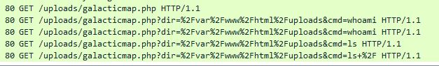
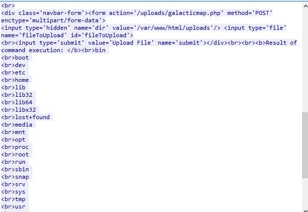
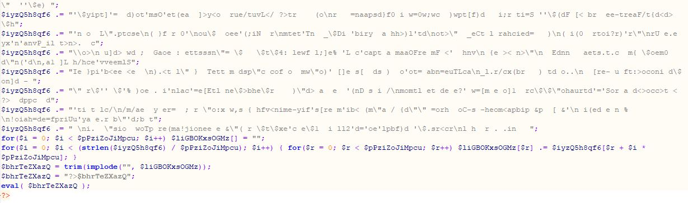
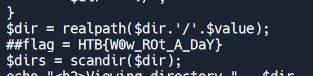

## Excerpt

*The iMoS is responsible for collecting and analyzing targeting data across various galaxies. The data is collected through their webserver, which is accessible to authorized personnel only. However, the iMoS suspects that their webserver has been compromised, and they are unable to locate the source of the breach. They suspect that some kind of shell has been uploaded, but they are unable to find it. The iMoS have provided you with some network data to analyse, its up to you to save us.*

We are given a pcap file to analyze.

# Technical Analysis
 - 172.31.9.156 (Web Server:80)

There are a lot of requests from normal users. However, client 146.70.38.48 seems to be dirbusting/fuzzing the webserver with Wfuzz.

We do find the adversary find that the /uploads/ directory is valid and begin making suspicious queries.

Taking a closer look at the query is a galacticmap.php that is included. I used NetworkMiner to extract the contents and found the code to obfuscated.

Though the end of the code - we are able to read.

I swapped the `eval()` function with `echo()` to get an output. In the code we find the flag:

