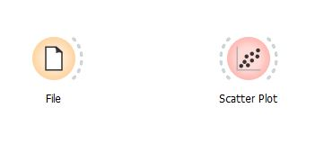
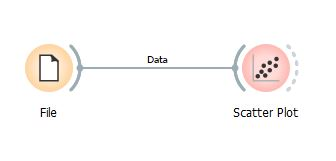
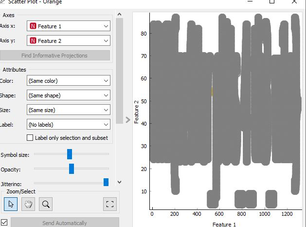
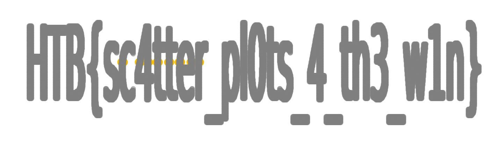

# Reconfiguration

*As Pandora set out on her quest to find the ancient alien relic, she knew that the journey would be treacherous. The desert was vast and unforgiving, and the harsh conditions would put her cyborg body to the test. Pandora started by collecting data about the temperature and humidity levels in the desert. She used a scatter plot in an Orange Workspace file to visualize this data and identified the areas where the temperature was highest and the humidity was lowest. Using this information, she reconfigured her sensors to better withstand the extreme heat and conserve water. But, a second look at the data revealed something otherwordly, it seems that the relic's presence beneath the surface has scarred the land in a very peculiar way, can you see it?*

We are given `analysis.ows` and `points.csv`. 

## Technical Analysis
The exercept tells us that Pandora used a software called Orange to visualize data.

The software is from [orangedatamining.com](https://orangedatamining.com/download/#windows). It allows you to take chunks of data and visualize it with tables, plots, etc.

After opening the file on Orange, we have a workspace staged for us.

We can drag the file towards the scatter plot.

Once we associate those two, we can open the scatter plot.

Now we can see the scatter plot. The excerpt tells us that the *relic's presence beneath the surface has scarred the land in a very peculiar way*. 

Using the magnifying tool, I found that I can scale the scatter plot by holding right-click on the mouse and got this:

